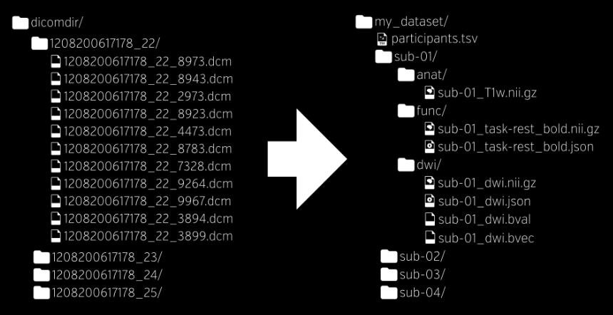
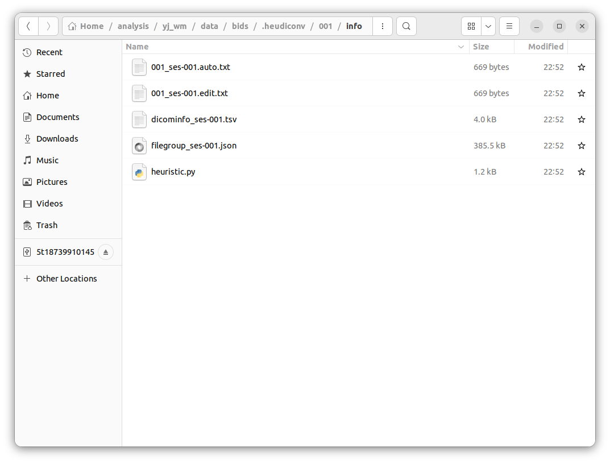
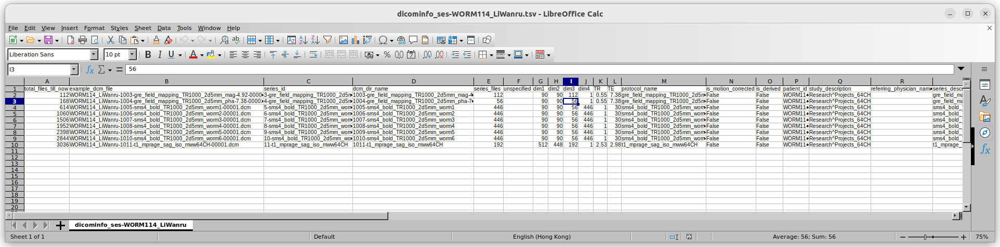

# 配置fmriprep运行环境
fmriprep官网推荐使用docker来配置fmriprep运行的环境，而不是使用Python分别配置其依赖包。
docker跟pipy类似，都是托管源代码的平台，但docker里面提供的“包”封装程度更高，这些包基本上都是能通过简单参数设置直接run的。docker里提供的包叫做image，fmriprep就是docker平台的一个image。

可以做一个不甚恰当的比喻，docker是一个卖方便食品的货架，image就是货架上摆的一盒泡面，泡面已经配好了所有需要的东西，加上热水就能吃了；而平时我们接触的包比较像是放在超市里的食材，需要我们选用包里面的功能自己进行配置和调用。


## 安装docker平台
为了让使用docker安装image就像用pip安装package一样方便，我们要在linux里先安装docker。
ctrl+alt+T 打开linux terminal (后文简称为termial，也就是linux的命令行)


### 在termial输入以下载并安装docker:
``` shell
# install docker
curl -fsSL https://get.docker.com | bash -s docker --mirror Aliyun
```
这里使用curl下载docker，并且在下载后直接使用bash执行docker install安装程序 
由于网速感人，使用Aliyun镜像下载成功率高一点。


### 检查docker是否安装成功
在检查之前，由于用户权限的问题（细节我也不清楚），需要先在terminal run这句：
``` shell
sudo chmod 666 /var/run/docker.sock
```
之后，run
``` shell
# check if install docker rightly
docker run --rm hello-world
```
如果没报错就说明安装成功。


## 从docker平台安装fmriprep
### 安装fmriprep image
在检查docker安装成功后，使用如下语句。根据想要的版本安一次就好，没有尝试能否同时存在不同版本的相同包，应该是可以的。
image就是fmriprep这个“包”
``` shell
# if we want to install certain version of fmriprep (eg. version 21.0.2)
docker pull nipreps/fmriprep:21.0.2

# if we want to install the latest version
docker pull nipreps/fmriprep:latest
```
这一步也有可能因为网络原因出错，出现如下错误：
``` shell
wanru@wanru-ubuntu:~$ docker pull nipy/heudiconv:latest
Error response from daemon: Get "https://registry-1.docker.io/v2/nipy/heudiconv/manifests/sha256:2ec24547e9a7a9f90d5bac31c0ed49d1625467f4ea92eadbd934cfb683190e8a": net/http: TLS handshake timeout
```
这时多试几次，一般都会好。

**警告：fmriprep 21.0.2版本有16GB，这意味着：
1 要保证root目录下至少有16GB剩余容量
2 下载的时间可能非常长，我大概下了3 h

### 检查fmriprep是否安装成功
在terminal输入如下语句，查看所有安装好的image
``` shell
docker images
```

可以得到如下output。看到列出的images中有fmriprep且版本匹配。这意味着安装成功。
``` shell
wanru@wanru-ubuntu:~$ docker images

REPOSITORY         TAG       IMAGE ID       CREATED        SIZE
nipreps/fmriprep   21.0.2    65bae2715842   6 weeks ago    16GB
hello-world        latest    feb5d9fea6a5   8 months ago   13.3kB

```


## 获取freesurfer许可证
这个许可证用于给予fmriprep调用freesurfer进行处理的权限，如果没有，因为fmriprep默认设置是会调用freesurfer，如果不自定义删除这个处理步骤，就会报错。

在如下链接进行注册，许可证 license.txt会发送到链接中所填写的邮箱。将其进行保存，存在常用目录或者fmri数据目录都可以。
https://surfer.nmr.mgh.harvard.edu/registration.html

填写成功提示：
># FreeSurfer Registration
Thank you for registering. Your FreeSurfer license #xxxxx has been emailed to xxxxxxxxx@xxxxx
Email fsregister@nmr.mgh.harvard.edu if you have problems with the attached license


# 配置dicom转换为BIDS格式文件的运行环境
## BIDS简介
fmriprep输入的原始数据必须为BIDS (Brain Imaging Data Structure)格式，这是一种较为通用的神经影像数据组织的方式，对于核磁数据来说，其基本结构如下图：

有了这样的结构，fmriprep就能自动识别各处理步骤所需要的文件，从而进行处理。


## 安装dcm2niix和heudiconv库
平时做完实验，从核磁中心拷贝回来的数据往往是dicom文件(.dcm格式)，所以要用一些转换工具把dicom转换为BIDS。
做这步转化的底层依赖包是主要基于C/C++编写的dcm2niix库 https://github.com/rordenlab/dcm2niix ，之后又有好心人用docker或python提供了更高级的接口来调用这个包，所以我们不必会C就能使用它。
由于C系语言需要编译，所以我们还要安装cmake这个帮助编译程序的包，来安装dcm2niix库

### 安装cmake
本地无法连上cmake官网，可以选择直接下载cmake Binary distributions， https://cmake.org/download/ 
下载默认在Downloads文件夹，用以下代码完成解压，并将cmake添加至环境变量以供从terminal直接调用
``` shell
cd ~/Downloads
tar -zxvf cmake-3.16.3-*-x86_64.tar.gz

export PATH="~/Downloads/cmake-3.16.3-Darwin-x86_64/CMake.app/Contents/bin/:$PATH"
```

### 安装dcm2niix
由于本地无法连上github，可以从github直接下载dcm2niix [Source code (tar.gz)](https://github.com/rordenlab/dcm2niix/archive/refs/tags/v1.0.20211006.tar.gz) ,之后把该文件解压（可以直接右键解压），切换目录到解压后文件夹，在其目录下创建一个名为build的文件夹，在其中编译dcm2niix

``` shell
cd dcm2niix
mkdir build
cd build
cmake ..
make
```

之后，将dcm2niix添加至环境变量以供从terminal直接调用
``` shell
export PATH="$HOME/Downloads/dcm2niix/build/bin/:$PATH"
```
查看环境变量
``` shell
# checking env variable
 export -p
 
# the output is
PATH="/home/wanru/Downloads/dcm2niix/build/bin/:/home/wanru/anaconda3/condabin:/usr/local/sbin:/usr/local/bin:/usr/sbin:/usr/bin:/sbin:/bin:/usr/games:/usr/local/games:/snap/bin:/snap/bin"
```
之后，可以用如下命令查看环境变量是否添加成功
``` shell
wanru@wanru-ubuntu:~$ export PATH="$HOME/Downloads/dcm2niix/build/bin/:$PATH"
wanru@wanru-ubuntu:~$ which dcm2niix
/home/wanru/Downloads/dcm2niix/build/bin//dcm2niix
```
如果which命令给出dcm2niix路径，即为添加成功。这个对环境变量的编辑会一直保持到本次关机重启。

### 安装heudiconv (一个docker image)
heudiconv是一个封装好的docker image，它调用dcm2niix来进行dicom到BIDS的转换，十分简便。
首先需要从docker安装heudiconv最新版
``` shell
docker pull nipy/heudiconv:latest
```
检查是否安装成功
``` shell
docker images
```
如果列出的项目中有heudiconv，即为安装成功。


# 使用heudiconv进行BIDS格式转换
## 准备好dicom文件
可以在项目的数据文件夹下建立dicom文件夹，把记录的数据拷贝此文件夹下，这个文件夹包含各个被试的文件；每个被试的文件夹里又包含着每个session的扫描文件，结构类似下图：
这里subject 编号为001 (必须为数字！)，session也为001
```
$HOME/analysis/yj_wm/data
└─dicom
	└─001 (subject 001)
		└─001 (subject 001, session 001)
			├─1003-gre_field_mapping_TR1000_2d5mm_mag-4.92
			├─1003-gre_field_mapping_TR1000_2d5mm_mag-7.38
			├─1004-gre_field_mapping_TR1000_2d5mm_pha-7.38
			├─1005-sms4_bold_TR1000_2d5mm_worm1
			├─1006-sms4_bold_TR1000_2d5mm_worm2
			├─1007-sms4_bold_TR1000_2d5mm_worm3
			├─1008-sms4_bold_TR1000_2d5mm_worm4
			├─1009-sms4_bold_TR1000_2d5mm_worm5
			├─1010-sms4_bold_TR1000_2d5mm_worm6
			└─1011-t1_mprage_sag_iso_mww64CH
	
```


## 使用heudiconv转换dicom到BIDS
### 生成转化过程中利用的脚本并进行修改
在data文件夹下新建bids文件夹，用于存放转化为BIDS的数据

#### 查看dicom信息
在terminal里运行：
``` shell
docker run -ti --rm -v $HOME/analysis/yj_wm:/base nipy/heudiconv:latest -d /base/data/dicom/{subject}/{session}/*/*.dcm -o /base/data/bids -f convertall -s 001 -ss 001 -c none --overwrite
```


运行后会在bids/.heudiconv/001/info下生成如下文件。.heudiconv是一个隐藏文件夹，需要在选项中设置查看隐藏文件才可显示。


我们需要查看.tsv文件来查看该被试该session中所有记录到的dicom run的信息。


#### 查看自动生成的heuristic.py，并根据.tsv文件进行修改
``` python
import os

def create_key(template, outtype=('nii.gz',), annotation_classes=None):
    if template is None or not template:
        raise ValueError('Template must be a valid format string')
    return template, outtype, annotation_classes

def infotodict(seqinfo):
    """Heuristic evaluator for determining which runs belong where
    allowed template fields - follow python string module:
    item: index within category
    subject: participant id
    seqitem: run number during scanning
    subindex: sub index within group
    """
    data = create_key('run{item:03d}')
    info = {data: []}
    last_run = len(seqinfo)
    for s in seqinfo:
        """
        The namedtuple `s` contains the following fields:
        * total_files_till_now
        * example_dcm_file
        * series_id
        * dcm_dir_name
        * unspecified2
        * unspecified3
        * dim1
        * dim2
        * dim3
        * dim4
        * TR
        * TE
        * protocol_name
        * is_motion_corrected
        * is_derived
        * patient_id
        * study_description
        * referring_physician_name
        * series_description
        * image_type
        """
        info[data].append(s.series_id)
    return info
```

自动生成的文件如上，只需要修改其中的infotodict()函数。
这个函数可以让我们自定义筛选dicom中的哪些文件是我们需要的。

在我们当前的研究中，一共有4类dicom文件：
* T1结构像 1011-t1_mprage_sag_iso_mww64CH
* 任务态 1005-sms4_bold_TR1000_2d5mm_worm1 一共有6个
* fieldmap magnitude
	* 1003-gre_field_mapping_TR1000_2d5mm_mag-4.92
	* 1003-gre_field_mapping_TR1000_2d5mm_mag-7.38
* fieldmap phase
	* 1004-gre_field_mapping_TR1000_2d5mm_pha-7.38

**该代码有三个地方需要自定义。**

##### 1 由于有4类dicom，所以需要创建4个字典的key，对应T1、任务态、fieldmap magnitude和fieldmap phase
``` python
    info = {t1w: [], func_task: [], fmap_mag: [], fmap_phase: []}  
```

##### 2 需要定义4类dicom对应的转化后文件名
以有多个run的任务态为例:
``` python
    func_task = create_key('sub-{subject}/{session}/func/sub-{subject}_{session}_task-worm_run-00{item:01d}_bold') 
```
create_key函数需要传入的参数就只有一个文件名string
这里如下部分是固定的
```
'sub-{subject}/{session}/func/sub-{subject}_{session}_
```
需要修改的是后面的部分。

整个文件名结尾是最重要的，根据dicom的类型，有以下几种可能
* bold
* T1w 结构像
* magnitude 
* phasediff
* dwi

固定部分和结尾的中间可以写较为详细的标注名称，例如，在任务态，常用task-加上任务名称，后接run number
* task-worm_run-001
* task-rest_run-001
在这里，我们根据注释的提示，将item (index within category)作为run的信息，加在文件名里面

##### 3 需要创建4类dicom的筛选条件
之后，通过遍历所有dicom文件，挑出以上四种类型dicom对应的文件。这一操作通过使用for对seqinfo循环来执行，seqinfo就是刚才提到的 .tsv文件，每次循环相当于读其中的一行。

为了保证能够挑选出类型对应的dicom文件，要设置对于当前类型独特的辩识条件。
例如，对于T1结构像来说，它的 .tsv文件里dim3为192，且protocol_name里有'mprage',其他三个类型都没有，因此将其选择条件设置为：
``` python
if (s.dim3 == 192) and ('mprage' in s.protocol_name):  
	info[t1w].append(s.series_id)  
```

对其他三个条件也是类似，最终代码如下所示：

``` python
import os  
  
  
def create_key(template, outtype=('nii.gz',), annotation_classes=None):  
    if template is None or not template:  
        raise ValueError('Template must be a valid format string')  
    return template, outtype, annotation_classes  
  
  
def infotodict(seqinfo):  

    """
    Heuristic evaluator for determining which runs belong where
    allowed template fields - follow python string module:
    item: index within category
    subject: participant id
    seqitem: run number during scanning
    subindex: sub index within group
    """ 
    t1w = create_key('sub-{subject}/{session}/anat/sub-{subject}_{session}_T1w')  
    
    func_task = create_key('sub-{subject}/{session}/func/sub-{subject}_{session}_task-worm_run-00{item:01d}_bold')   
    
	fmap_mag = create_key('sub-{subject}/{session}/fmap/sub-{subject}_{session}_magnitude') 
	
    fmap_phase = create_key('sub-{subject}/{session}/fmap/sub-{subject}_{session}_phasediff')  
  

    info = {t1w: [], func_task: [], fmap_mag: [], fmap_phase: []}  
  
    for idx, s in enumerate(seqinfo):  
        if (s.dim3 == 192) and ('mprage' in s.protocol_name):  
            info[t1w].append(s.series_id)  
        if (s.dim4 == 446) and ('bold' in s.protocol_name):  
            info[func_task].append(s.series_id)  
        if (s.dim3 == 112) and ('gre_field' in s.protocol_name):  
            info[fmap_mag].append(s.series_id)  
        if (s.dim3 == 56) and ('gre_field' in s.protocol_name):  
            info[fmap_phase].append(s.series_id)  
  
    last_run = len(seqinfo)  

    return info
```

保存该代码，之后的转换即在docker中调用这段代码来进行。

### 使用docker调用heudiconv进行转换
在terminal run如下代码
这里的/{subject}/{session}必须为这样的格式，对应的{subject}取 -s 后面的值，{session}取 -ss后面的值。
``` shell
docker run -ti --rm -v $HOME/analysis/yj_wm:/base nipy/heudiconv:latest -d /base/data/dicom/{subject}/{session}/*/*.dcm -o /base/data/bids/ -f /base/data/bids/code/heuristic.py -s 001 -ss 001 -c dcm2niix -b --overwrite

```
注意指定dicom所在目录、存放转化后BIDS的目录、heuristic.py所在目录

``` shell
sudo chown -R wanru bids
```


## BIDS格式转换 批处理 batch
``` python
# python script
# -*- coding: utf-8 LF
"""
@author: Wanru Li
@contact: wliwanru@foxmail.com
@create: 14/6/2022-4:18 PM
"""

from subprocess import run

base_dir = "$HOME/analysis/yj_wm/data/"
subject_list = ['01', '02']
session_dict = {'01': ['01', '02'],
                '02': ['01', '02', '03']}


run("echo 000000 | sudo -S chmod 666 /var/run/docker.sock", shell=True)
run(f"mkdir {base_dir}/bids", shell=True)

for i_subject in subject_list:
    i_session_list = session_dict[i_subject]
    for i_session in i_session_list:
        print(f'now is sub {i_subject}, session {i_session}')
        run(f"docker run -i --rm -v {base_dir}:/base "
            "nipy/heudiconv:latest "
            "-d /base/dicom/{subject}/{session}/*/*.dcm "
            "-o /base/bids/ "
            "-f /base/bids/code/heuristic.py "
            f"-s {i_subject} -ss {i_session} "
            "-c dcm2niix -b "
            "--overwrite ", shell=True)

run(f"echo 000000 | sudo -S chown -R wanru {base_dir}/bids", shell=True)

#run(f"docker run -i --rm -v {base_dir}/bids:/data:ro "
#    "bids/validator /data", shell=True)

```


## (optional) 使用BIDS validator验证BIDS格式是否合法
### 方法1
http://bids-standard.github.io/bids-validator/
选择BIDS的整个文件夹，即转化好的每个被试文件夹的上层目录。

### 方法2
安装docker版的bids/validator，本地进行验证
* 安装
``` shell
# install
docker pull bids/validator
# check installation
docker images
```
* 检查
``` shell
docker run -ti --rm -v $HOME/analysis/yj_wm/data/bids:/data:ro bids/validator /data
```

如果想在python里调用，请使用heudiconv batch脚本里面最后两行——取消注释即可。

### 方法3
其实在运行docker fmriprep的时候会自动进行validate，验证不通过会报错。所以不自行validate也可以。


# 运行fmriprep
使用如下语句，指定好
* input BIDS data文件夹 /data
* 生成的处理结果和处理报告的文件夹 /out
* 可能产生的中间步骤产物，以及运行失败时的中间步骤文件存储的地方 /work
* freesurfer license所在的文件夹 /license
``` shell
docker run -ti --rm -v $HOME/analysis/yj_wm/data/bids:/data:ro -v $HOME/analysis/yj_wm/derivatives:/out -v$HOME/analysis/license.txt:/license -v $HOME/analysis/yj_wm/working:/work nipreps/fmriprep:21.0.2 /data /out participant -w /work --fs-license-file /license

```

如果不想进行bids validatation，对代码做如下改动，加上--skip_bids_validatation
``` shell
docker run -ti --rm -v $HOME/analysis/yj_wm/data/bids:/data:ro -v $HOME/analysis/yj_wm/derivatives:/out -v$HOME/analysis/license.txt:/license -v $HOME/analysis/yj_wm/working:/work nipreps/fmriprep:21.0.2 --skip_bids_validation /data /out participant -w /work --fs-license-file /license

```

6个run的数据大概跑了不到3 h。

运行结束后，也可能会发现用户对结果文件夹derivatives没有访问权限，可以运行如下语句解决此问题
``` shell
cd $HOME/analysis/yj_wm
sudo chown -R wanru derivatives
```

运行结果都在derivatives文件夹下，查看其中的sub-001.html可以查看预处理结果图。


https://osf.io/k89fh/wiki/fmriprep-docker/

## fmriprep 批处理 batch
``` python
# python script
# -*- coding: utf-8 LF
"""
@author: Wanru Li
@contact: wliwanru@foxmail.com
@create: 14/6/2022-7:38 PM
"""
from subprocess import run

base_dir = "$HOME/analysis/yj_wm/data/"
fs_license_dir = "$HOME/analysis/license.txt"

subject_list = ['01', '02']

run("echo 000000 | sudo -S chmod 666 /var/run/docker.sock", shell=True)
for i_subject in subject_list:
    print(f'now is subject {i_subject}')
    run("docker run -i --rm "
        f"-v {base_dir}/bids:/bids_data_dir:ro "
        f"-v {base_dir}/derivatives:/output_dir "
        f"-v {fs_license_dir}:/license "
        f"-v {base_dir}/working:/working "
        "nipreps/fmriprep:21.0.2 /bids_data_dir /output_dir "
        f"participant --participant-label {i_subject} "
        "-w /working --fs-license-file /license", shell=True)
    print(f'subject {i_subject} finished! ')

run(f"echo 000000 | sudo -S chown -R wanru {base_dir}", shell=True)

```

